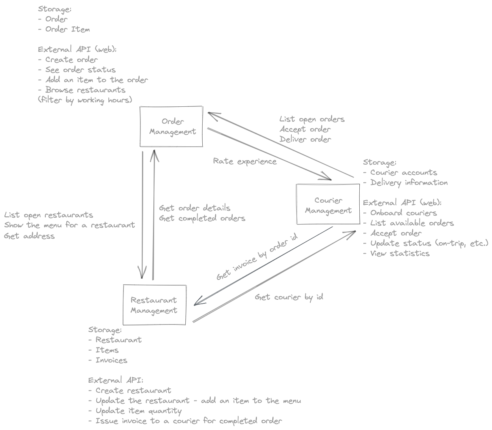

# Uber Delivery

## Sample architecture

- - - -
## Order management

### MVP:
* Place order through UI
* CRUD API for orders
### Storage
* Order
* Item
### Business objective:
* Provide a way for restaurants to create orders for delivery.
* Define orders as a delivery of a meal from a restaurant (point A) to a client address (point B).
* Store the details entered from an UI.
* Provide the open orders to the courier management component
* Provide order details to the restaurant/invoice component
* Ability to choose items in the order from a menu
* Nice to have:
  - Menu to be filtered/ordered by category or price of item
  - Delivery cost estimation
  - Order status page to the customer
### Backend
  * Define data structure for the requirements
  * Provide API for the input UI
  * State machine for order statuses
  * Stores the order
  * API:
    - Endpoint for retrieving open orders
    - Endpoint for retrieving one order by id
    - Endpoint for modifying/updating order
    - Endpoint for creating an order
### Frontend - user places order to deliver from point A (restaurant address) to point B (client address)
  * A form collecting details about the order
  * Potential collaboration with Restaurants team on Google Map integration - for displaying/picking locations
  * Integration with the Courier Management team for providing an order status page to the customer
  * Wire-frame/Mockup: Orders MVP [Orders MVP](../resources/OrdersMVP.pdf)

- - - -
## Courier management
### MVP:
* Create a courier from UI (login/register)
* Couriers to select and complete orders
### Storage
* Courier
* Delivery
### Business objective:
* App where couriers register/login and chooses orders
* Go online - couriers can be active or inactive and they have a switch in the system. They can reactivate only when they finish their active order
* Service which assigns orders to couriers - couriers can browse all open orders - if the courier is available he can choose to start the order.
* Once a courier takes an order he is no longer eligible for other orders until they finish the current order
* When a courier logs in the system they can view the list of available orders (for them) and choose an order they are going to deliver. Orders properties which are shown are start position, end position, price. Once they've chosen an order they can view more detailed information for the order - they can phone the client, see client name/address.
* Statistics page
* Nice to have:
  - Restaurants are ordered by nearest address - if a new order is placed, an available courier is chosen based on his proximity to the restaurant and is shown the start/end address (without PII info)
  - Request an invoice from the restaurant component
  - Delivery estimation
  - Rating Couriers
### Backend
* Define data structure for the requirements
* Provide API for the input UI
* Stores the courier/delivery information in a database
* API:
    - Endpoint for creating a courier (login with email afterwards)
    - Endpoint for modifying/updating courier (availability status)
    - Endpoint for updating order status
### Frontend
  * Wireframe/Mockup: [Couriers Form MVP](../resources/CouriersMVP.pdf)
  * Login with email address (no password)
    - Login/Signup in once
  * Ability to finish the active order
  * Couriers can view aggregated statistics for:
    - Active time (when the courier is delivering orders)
    - Earned money
    - Distance
  * Nice to have:
    - Delivery ETA
    - Filter restaurants by current address

- - - -
## Restaurant management

### MVP:
* Create restaurant through UI
* CRUD API for restaurant (and menu) management
### Storage
* Restaurant
* Product
### Business objective - Provide a way for employees to create restaurants with menus
* Define a restaurant - name, delivery price, working hours and address (point A)
* Create restaurant, add items to restaurant menu. Items to have categories and quantities. Restaurants to have working hours and not accept orders if they are outside working hours
* Store the details entered from a UI
* View all restaurants and their menus in the UI
* Provide the (currently) open restaurants to the order management component
* Provide restaurant menu details to the order management component
* Nice to have:
  - Meal-time preparation estimation
  - Provide an invoice to the courier management system - Couriers to request an invoice by providing an order id. Restaurants can fetch order details from order management component. Also, delivery details can be fetched from courier component.
     - Sample invoice: Order from McDonalds {restaurant name} was delivered by Stan {courier name} on 15.07 {date of delivery}.

### Backend - Restaurant admin panel
* Define data structure for the requirements
* Provide API for the input UI
  - Stores the restaurants & invoices in a database
* API:
  - Endpoint for creating a restaurant
  - Endpoint for retrieving open restaurants
  - Endpoint for retrieving one restaurant by id
  - Endpoint for modifying/updating restaurants
### Frontend
* An admin to add a restaurant (or item to a restaurant)
* Wireframe/Mockup: [Restaurants Form MVP](../resources/RestaurantsMVP.pdf) (A form collecting details about the restaurant and its menu)
* Page to view all restaurants with different filter options
* Nice to have:
  - Separate buttons (“view all /completed/ orders”) and  (“generate invoice”)
  - Potential collaboration with Orders and Couriers teams on Google Maps integration - for displaying/picking locations
